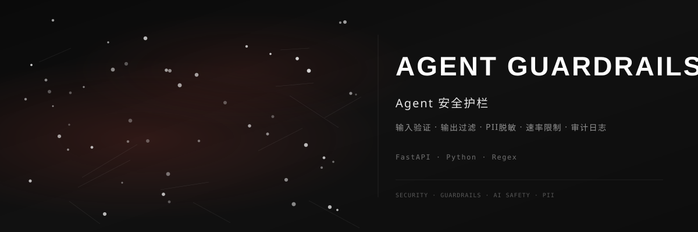

<div align="center">



<br>

### 🛡️ Agent 安全护栏

[](https://github.com/dirjaker/agent_guardrails/stargazers)
[](https://github.com/dirjaker/agent_guardrails/network/members)
[](https://github.com/dirjaker/agent_guardrails/graphs/contributors)
[](https://github.com/dirjaker/agent_guardrails/blob/dev/LICENSE)

</div>

---

## ✨ 功能特性

| 功能 | 描述 |
|------|------|
| 🔍 **输入验证** | 检测并拦截恶意输入、Prompt 注入攻击 |
| 🚫 **输出过滤** | 过滤敏感信息、有害内容、不当回复 |
| 🔒 **PII 脱敏** | 自动识别并脱敏手机号、邮箱、身份证等个人信息 |
| ⏱️ **速率限制** | 基于 Token Bucket 的请求频率控制 |
| 📋 **工具白名单** | 限制 Agent 可调用的工具和 API 范围 |
| 📝 **审计日志** | 完整记录所有请求和响应，支持回溯分析 |


## 🚀 快速开始

```bash
# 克隆项目
git clone https://github.com/dirjaker/agent_guardrails.git
cd agent_guardrails

# 创建虚拟环境
conda create -n agent_guardrails python=3.12 -y
conda activate agent_guardrails

# 安装依赖
pip install -r requirements.txt

# 运行项目
python main.py
```

## 🛠️ 技术栈

| 层级 | 技术 |
|------|------|
| **后端** | FastAPI, Pydantic |
| **安全引擎** | Python, Regex, NLP |
| **存储** | SQLite, Redis |
| **监控** | Prometheus, Grafana |

## 📝 开发日志

- [x] 输入验证和注入检测
- [x] 输出过滤和内容审核
- [x] PII 自动脱敏
- [x] 速率限制
- [x] 审计日志系统
- [ ] 机器学习增强检测
- [ ] 自定义规则引擎
- [ ] Web 管理界面

## 📄 许可证

[MIT License](LICENSE)

---

<div align="center">

🔗 **GitHub**: [dirjaker/agent_guardrails](https://github.com/dirjaker/agent_guardrails)

⭐ 如果这个项目对你有帮助，请给一个 Star 支持一下！

</div>
